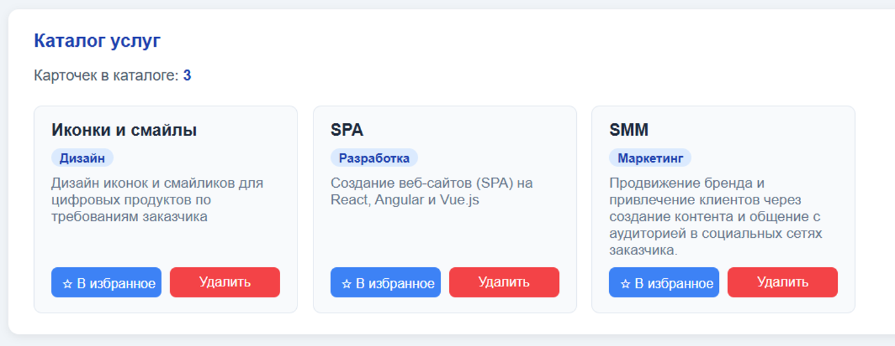
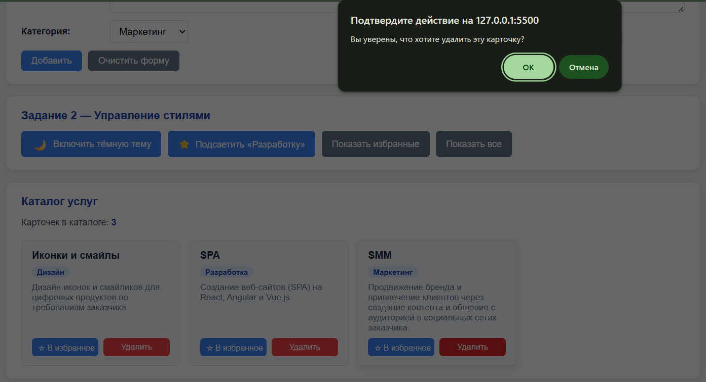
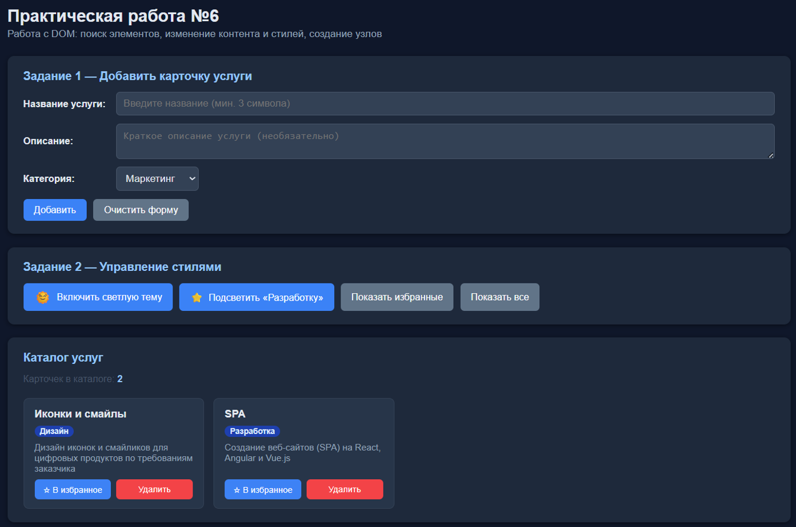
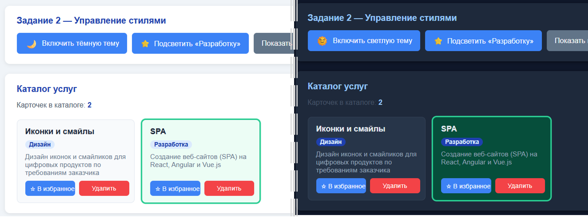

# 📦 Практическая работа №6: Работа с DOM

> Проект «Интерактивная витрина услуг» — закрепление тем: querySelector, textContent, classList, createElement, DocumentFragment.

🔗 [Посмотреть демо](https://igorao2802-dev.github.io/js-practice-06/) _(опционально)_  
📁 [Исходный код](https://github.com/igorao2802-dev/js-practice-06)

---

## 🛠 Используемые технологии

| Технология        | Назначение                                                                             |
| ----------------- | -------------------------------------------------------------------------------------- |
| HTML5             | Разметка страницы (Форма создания, Управление отображением, Каталог услуг, PRO-секция) |
| CSS3              | Стилизация интерфейса (карточки услуг, кнопки, тёмная тема, адаптивность)              |
| JavaScript (ES6+) | Манипуляции с DOM, валидация, работа с классами, DocumentFragment                      |

---

## 📋 Созданные функции и их назначение

### 🌍 Глобальные данные

| Переменная          | Тип     | Назначение                                         |
| ------------------- | ------- | -------------------------------------------------- |
| `cards`             | Array   | Массив объектов карточек услуг                     |
| `isHighlightActive` | boolean | Флаг состояния подсветки категории «Разработка»    |
| `demoCardsCount`    | number  | Счётчик демо-карточек для своевременного обнуления |

---

### 🧮 Задание 1: Добавление карточки услуги (createElement) — Уровень БАЗА

| Функция                        | Тип                  | Параметры                               | Возвращает  | Назначение                                 |
| ------------------------------ | -------------------- | --------------------------------------- | ----------- | ------------------------------------------ |
| `createCard(cardData, isDemo)` | Function Declaration | `cardData` (object), `isDemo` (boolean) | DOM Element | Создание DOM-элемента карточки услуги      |
| `updateCounter()`              | Function Declaration | —                                       | —           | Обновление счётчика карточек в каталоге    |
| `validateTitle(title)`         | Function Declaration | `title` (string)                        | string/null | Валидация названия услуги (мин. 3 символа) |
| `showError(message)`           | Function Declaration | `message` (string)                      | —           | Вывод сообщения об ошибке под формой       |

> 💡 **Почему createElement**: Использую `createElement`, потому что нужно создать элемент программно, а не через `innerHTML`. Это безопаснее и позволяет контролировать каждый узел отдельно.

> 💡 **Почему textContent**: Использую `textContent`, потому что он экранирует HTML-теги и предотвращает XSS-инъекции. Если пользователь введёт `<script>alert('XSS')</script>`, это отобразится как текст, а не выполнится.

```javascript
// createElement: создаю новый DOM-элемент динамически
// Использую createElement, потому что нужно создать элемент программно, а не через innerHTML
const card = document.createElement("div");

// textContent: защита от XSS при выводе пользовательских данных
title.textContent = cardData.title;
```

---

### 🔍 Задание 2: Управление стилями (classList) — Уровень JUNIOR

| Метод                | Тип        | Параметры            | Возвращает | Назначение                                  |
| -------------------- | ---------- | -------------------- | ---------- | ------------------------------------------- |
| `classList.toggle()` | DOM Method | `className` (string) | boolean    | Переключение класса .dark-theme на body     |
| `classList.add()`    | DOM Method | `className` (string) | —          | Добавление класса .highlight для избранного |
| `classList.remove()` | DOM Method | `className` (string) | —          | Удаление класса .hidden для отображения     |

> 💡 **Почему classList**: Использую `classList`, потому что это безопасный способ управления классами. Он не перезаписывает существующие классы, в отличие от `className`.

> 💡 **Почему toggle**: Использую `toggle`, потому что нужно добавлять/удалять класс одним действием. Это проще, чем проверять наличие класса и вызывать `add`/`remove` отдельно.

```javascript
// classList.toggle: переключает класс dark-theme на body
// Использую toggle, потому что нужно добавлять/удалять класс одним действием
document.body.classList.toggle("dark-theme");

// classList.toggle: переключает класс highlight на карточке
card.classList.toggle("highlight");
```

---

### 🔎 Задание 3: Оптимизация (DocumentFragment) — Уровень PRO

| Метод                               | Тип        | Параметры  | Возвращает       | Назначение                                 |
| ----------------------------------- | ---------- | ---------- | ---------------- | ------------------------------------------ |
| `document.createDocumentFragment()` | DOM Method | —          | DocumentFragment | Создание фрагмента для оптимизации вставки |
| `fragment.append()`                 | DOM Method | `...nodes` | —                | Добавление узлов во фрагмент (не в DOM)    |
| `container.append(fragment)`        | DOM Method | `fragment` | —                | Вставка всего фрагмента в DOM за один раз  |

> 💡 **Почему DocumentFragment**: Использую `DocumentFragment`, потому что вставка происходит за ОДИН раз в DOM. Это уменьшает количество перерисовок страницы и улучшает производительность. Без DocumentFragment каждая карточка вызывала бы перерисовку DOM (10 или 100 раз). С DocumentFragment перерисовка происходит только 1 раз после вставки всего фрагмента.

```javascript
// DocumentFragment: создаю фрагмент документа для оптимизации
// Использую DocumentFragment, потому что вставка происходит за ОДИН раз в DOM
const fragment = document.createDocumentFragment();

for (let i = 0; i < demoServices.length; i++) {
  // append: добавляю карточку во фрагмент (не в DOM напрямую)
  fragment.append(createCard(cardData, true));
}

// append: добавляю весь фрагмент в контейнер за один раз
// Только здесь происходит одна перерисовка DOM для всех карточек
container.append(fragment);
```

---

### 🗑️ Удаление карточек (remove + confirm)

| Метод              | Тип          | Параметры          | Возвращает | Назначение                          |
| ------------------ | ------------ | ------------------ | ---------- | ----------------------------------- |
| `element.remove()` | DOM Method   | —                  | —          | Удаление элемента из DOM            |
| `confirm()`        | Browser API  | `message` (string) | boolean    | Запрос подтверждения у пользователя |
| `textContent = ""` | DOM Property | string             | —          | Безопасная очистка контейнера       |

> 💡 **Почему remove**: Использую `remove`, потому что это современный и понятный способ удаления узла. Не нужно искать родителя и вызывать `removeChild`, элемент удаляет сам себя.

> 💡 **Почему confirm**: Использую `confirm`, потому что это требование безопасности (защита от случайного удаления). Пользователь должен осознанно подтвердить действие.

```javascript
// confirm: требую подтверждение перед удалением
// Использую confirm, потому что это требование безопасности
const confirmDelete = confirm("Вы уверены, что хотите удалить эту карточку?");

if (!confirmDelete) {
  return;
}

// remove: удаляет элемент из DOM
// Использую remove, потому что это современный способ удаления узла
card.remove();
```

---

## ❓ Ответы на контрольные вопросы (Interview Questions)

### 1. Чем querySelector отличается от querySelectorAll? Что возвращает второй метод?

| Метод                | Возвращает                            | Когда использовать                       |
| -------------------- | ------------------------------------- | ---------------------------------------- |
| `querySelector()`    | Первый найденный элемент (или `null`) | Когда нужен один конкретный элемент      |
| `querySelectorAll()` | NodeList всех найденных элементов     | Когда нужно работать с группой элементов |

**Пример:**

```javascript
// Один элемент:
const btn = document.querySelector("#add-btn");

// Все элементы:
const cards = document.querySelectorAll(".service-card");
cards.forEach(card => { ... });
```

---

### 2. Почему в этой работе мы отдаём предпочтение textContent, а не innerHTML?

| Критерий               | `textContent`                           | `innerHTML`                             |
| ---------------------- | --------------------------------------- | --------------------------------------- |
| **Безопасность**       | ✅ Экранирует HTML-теги (защита от XSS) | ❌ Выполняет HTML-код (риск инъекций)   |
| **Производительность** | ✅ Быстрее (не парсит HTML)             | ❌ Медленнее (парсинг HTML)             |
| **Когда использовать** | Для пользовательских данных             | Для статичного, заранее известного HTML |

**Пример:**

```javascript
// БЕЗОПАСНО (пользовательские данные):
title.textContent = userInput; // "<script>" отобразится как текст

// ДОПУСТИМО (статичный HTML):
infoBlock.innerHTML = "<ul><li>Статичный контент</li></ul>";
```

---

### 3. Как работает метод classList.toggle()? Опишите логику.

> **`classList.toggle()`** проверяет наличие класса на элементе:
>
> - Если класса **нет** — добавляет его
> - Если класс **есть** — удаляет его

**Пример:**

```javascript
// Переключение темы:
document.body.classList.toggle("dark-theme");

// Переключение избранного:
card.classList.toggle("highlight");
```

**Преимущества:**

- ✅ Один метод вместо проверки + add/remove
- ✅ Чище и понятнее код
- ✅ Меньше вероятность ошибок

---

### 4. Что такое «узел» (node) и «элемент» (element) в контексте DOM?

| Понятие               | Описание                               | Пример                           |
| --------------------- | -------------------------------------- | -------------------------------- |
| **Node (Узел)**       | Базовый тип всех объектов в DOM-дереве | Element, Text, Comment, Document |
| **Element (Элемент)** | Конкретный тип узла — HTML-тег         | `<div>`, `<h3>`, `<button>`      |

**Иерархия:**

```
Node (базовый тип)
  └── Element (HTML-теги)
        └── HTMLElement (конкретные теги)
              └── HTMLDivElement, HTMLButtonElement, ...
```

**Пример:**

```javascript
const node = document.createTextNode("Текст"); // Node, но не Element
const element = document.createElement("div"); // Element (и тоже Node)
```

---

### 5. Зачем нужен DocumentFragment и в каких случаях его использование оправдано?

> **`DocumentFragment`** — это лёгкий контейнер для хранения узлов DOM без добавления их в основное дерево документа.

**Когда использовать:**
| Сценарий | Без Fragment | С Fragment |
|----------|-------------|------------|
| Вставка 10 карточек | 10 перерисовок DOM | 1 перерисовка DOM |
| Вставка 100 карточек | 100 перерисовок DOM | 1 перерисовка DOM |
| Производительность | ❌ Медленно | ✅ Быстро |

**Пример:**

```javascript
// БЕЗ DocumentFragment (медленно):
for (let i = 0; i < 100; i++) {
  container.append(createCard()); // 100 перерисовок
}

// С DocumentFragment (быстро):
const fragment = document.createDocumentFragment();
for (let i = 0; i < 100; i++) {
  fragment.append(createCard()); // 0 перерисовок
}
container.append(fragment); // 1 перерисовка
```

---

## 📸 Скриншоты работы

<!--






-->

---

## 📝 Инструкция по запуску

1. **Клонируйте репозиторий:**

   ```bash
   git clone https://github.com/igorao2802-dev/js-practice-06.git
   cd js-practice-06
   ```

2. **Откройте в VS Code:**

   ```bash
   code .
   ```

3. **Запустите Live Server:**
   - Установите расширение "Live Server" (если нет)
   - Нажмите правой кнопкой на `index.html` → "Open with Live Server"

4. **Проверьте в браузере:**
   - Откройте DevTools (F12)
   - Убедитесь, что в Console нет ошибок
   - Протестируйте все функции проекта

---

_Выполнил: Осадчий И.А._  
_Дата: 21.03.2026_  
_Группа: 2509_
